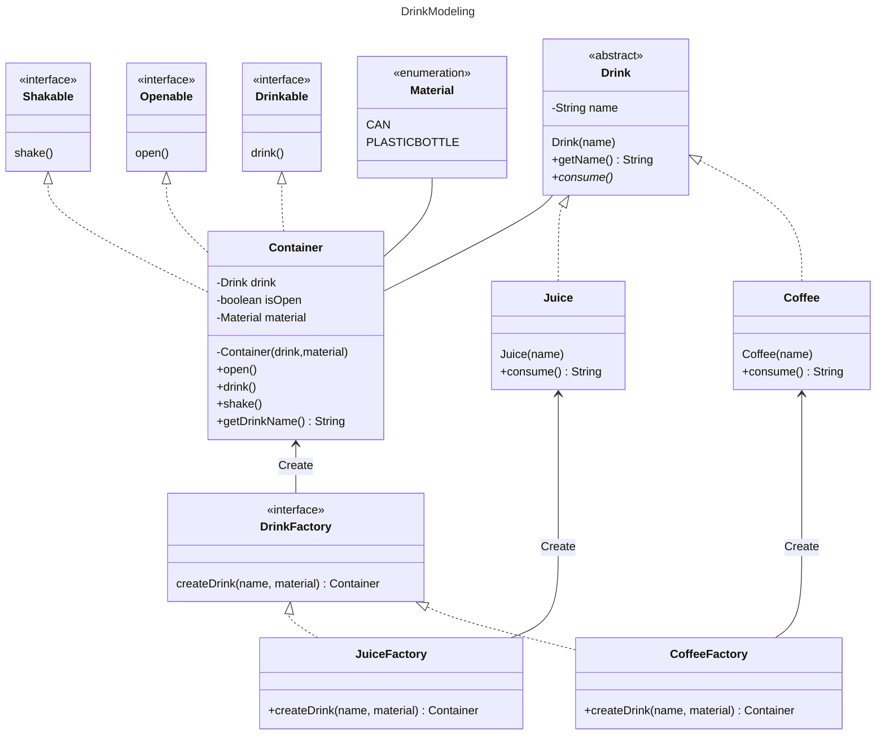

```mermaid
---
title: DrinkModeling
---
classDiagram
    direction BT
    class DrinkFactory{
        <<interface>>
        createDrink(name, material) Container
    }
    class Drink{
        <<abstract>>
        -String name
        Drink(name)
        +getName() String
        +consume()*
    }
    class CoffeeFactory{
        +createDrink(name, material) Container
    }
    class JuiceFactory{
        +createDrink(name, material) Container
    }
    class Coffee{
        Coffee(name)
        +consume() String
    }
    class Juice{
        Juice(name)
        +consume() String
    }
    class Shakable{
        <<interface>>
        shake()
    }
    class Openable{
        <<interface>>
        open()
    }
    class Drinkable{
        <<interface>>
        drink()
    }
    class Material{
        <<enumeration>>
        CAN
        PLASTICBOTTLE
    }
    class Container{
        -Drink drink
        -boolean isOpen
        -Material material
        -Container(drink,material)
        +open()
        +drink()
        +shake()
        +getDrinkName() String
    }
    
    CoffeeFactory ..|> DrinkFactory
    JuiceFactory ..|> DrinkFactory
    DrinkFactory --> Container : Create
    Container ..|> Shakable
    Container ..|> Openable
    Container ..|> Drinkable
    Coffee ..|> Drink
    Juice ..|> Drink
    Container -- Drink
    Container -- Material
    CoffeeFactory --> Coffee : Create
    JuiceFactory --> Juice : Create
```